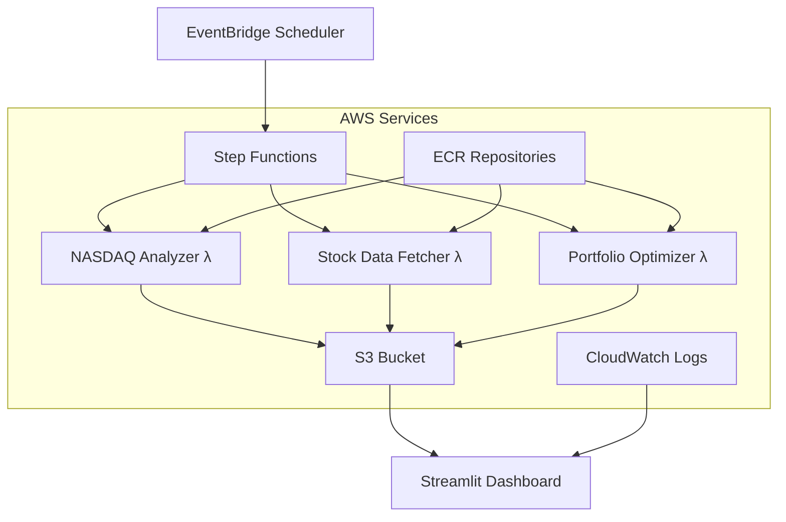

# Portfolio Optimization AWS Pipeline

A cloud-native portfolio optimization system built with AWS Lambda, S3, Step Functions, EventBridge, and Streamlit that analyzes the full NASDAQ-100 stocks using multiple optimization strategies with automated monthly execution.

## 🏗️ Architecture Overview



**Key Components:**
- **EventBridge**: Triggers monthly execution (1st of each month)
- **Step Functions**: Orchestrates the 3 Lambda functions sequentially
- **Lambda Functions**: Containerized with Docker, deployed via ECR
- **S3**: Centralized data storage with organized folder structure
- **CloudWatch**: Real-time monitoring and logging
- **Streamlit**: Comprehensive 5-page dashboard with live AWS data

## 📦 Components

### 1. NASDAQ Analyzer Lambda (`src/nasdaq_analyzer/`)
- **Purpose**: Scrapes NASDAQ-100 components and calculates undervaluation rates
- **Input**: Triggered manually or by schedule
- **Output**: Raw and processed NASDAQ analysis data to S3
- **Key Features**:
  - Web scraping from Wikipedia and Yahoo Finance
  - Undervaluation rate calculation
  - Error handling and retry logic

### 2. Stock Data Fetcher Lambda (`src/stock_data_fetcher/`)
- **Purpose**: Downloads historical stock data and calculates returns/volatility
- **Input**: NASDAQ analysis results from S3
- **Output**: Individual stock CSV files and aggregated metrics
- **Key Features**:
  - 5-year historical data download via yfinance
  - Annualized return and volatility calculation
  - Individual stock data storage

### 3. Portfolio Optimizer Lambda (`src/portfolio_optimizer/`)
- **Purpose**: Runs portfolio optimization using multiple models
- **Input**: Stock data with calculated metrics
- **Output**: Optimized portfolio weights and performance analysis
- **Models Supported**:
  - Mean-Variance Optimization (Markowitz)
  - Risk Parity
  - Black-Litterman
- **Return Types**: Historical returns, undervaluation rates, or both

### 4. Streamlit Dashboard (`dashboard/`)
- **Purpose**: Comprehensive 5-page interactive dashboard with real AWS data
- **Pages**:
  - **Executive Summary**: Key metrics and top opportunities
  - **Stock Analysis**: Individual stock deep-dive with filtering
  - **Portfolio Optimization**: Model comparison and allocation charts
  - **Historical Tracking**: Pipeline execution history and trends
  - **System Status**: Real-time AWS monitoring and manual controls
- **Features**:
  - Live CloudWatch logs integration
  - Real Step Functions execution history
  - Interactive risk-return visualizations
  - Downloadable portfolio allocations
  - User guidance and quick start guides

### 5. Shared Utilities (`shared/`)
- **Purpose**: Common S3 operations and Lambda utilities
- **Features**:
  - S3 upload/download helpers
  - Event parsing
  - Configuration management
  - Error handling

## 🚀 Deployment Guide

### Prerequisites

1. **AWS Account** with appropriate permissions
2. **AWS CLI** configured
3. **Docker** installed
4. **Python 3.11+**

### Step 1: S3 Bucket Setup

```bash
# Create S3 bucket
aws s3 mb s3://your-portfolio-bucket

# Set bucket policy (replace with your bucket name)
aws s3api put-bucket-policy --bucket your-portfolio-bucket --policy file://bucket-policy.json
```

Create `bucket-policy.json`:
```json
{
  "Version": "2012-10-17",
  "Statement": [
    {
      "Effect": "Allow",
      "Principal": {
        "AWS": "arn:aws:iam::YOUR-ACCOUNT-ID:root"
      },
      "Action": "s3:*",
      "Resource": [
        "arn:aws:s3:::your-portfolio-bucket",
        "arn:aws:s3:::your-portfolio-bucket/*"
      ]
    }
  ]
}
```

### Step 2: Deploy Lambda Functions

#### Option A: Using Docker (Recommended)

```bash
# Login to ECR (use us-west-1 for consistency)
aws ecr get-login-password --region us-west-1 | docker login --username AWS --password-stdin YOUR-ACCOUNT-ID.dkr.ecr.us-west-1.amazonaws.com

# Create ECR repositories
aws ecr create-repository --repository-name nasdaq-analyzer --region us-west-1
aws ecr create-repository --repository-name stock-data-fetcher --region us-west-1
aws ecr create-repository --repository-name portfolio-optimizer --region us-west-1

# Build and push NASDAQ Analyzer (IMPORTANT: Use --platform linux/amd64 for AWS Lambda compatibility)
cd src/nasdaq_analyzer
docker build --platform linux/amd64 --provenance=false -t nasdaq-analyzer .
docker tag nasdaq-analyzer:latest YOUR-ACCOUNT-ID.dkr.ecr.us-west-1.amazonaws.com/nasdaq-analyzer:latest
docker push YOUR-ACCOUNT-ID.dkr.ecr.us-west-1.amazonaws.com/nasdaq-analyzer:latest

# Build and push Stock Fetcher
cd ../stock_data_fetcher
docker build --platform linux/amd64 --provenance=false -t stock-data-fetcher .
docker tag stock-data-fetcher:latest YOUR-ACCOUNT-ID.dkr.ecr.us-west-1.amazonaws.com/stock-data-fetcher:latest
docker push YOUR-ACCOUNT-ID.dkr.ecr.us-west-1.amazonaws.com/stock-data-fetcher:latest

# Build and push Portfolio Optimizer
cd ../portfolio_optimizer
docker build --platform linux/amd64 --provenance=false -t portfolio-optimizer .
docker tag portfolio-optimizer:latest YOUR-ACCOUNT-ID.dkr.ecr.us-west-1.amazonaws.com/portfolio-optimizer:latest
docker push YOUR-ACCOUNT-ID.dkr.ecr.us-west-1.amazonaws.com/portfolio-optimizer:latest
```

#### Create Lambda Functions

```bash
# Create execution role
aws iam create-role --role-name PortfolioLambdaRole --assume-role-policy-document file://lambda-trust-policy.json
aws iam attach-role-policy --role-name PortfolioLambdaRole --policy-arn arn:aws:iam::aws:policy/service-role/AWSLambdaBasicExecutionRole
aws iam attach-role-policy --role-name PortfolioLambdaRole --policy-arn arn:aws:iam::aws:policy/AmazonS3FullAccess

# Create Lambda functions (all in us-west-1 region)
aws lambda create-function \
  --function-name nasdaq-analyzer-docker \
  --package-type Image \
  --code ImageUri=YOUR-ACCOUNT-ID.dkr.ecr.us-west-1.amazonaws.com/nasdaq-analyzer:latest \
  --role arn:aws:iam::YOUR-ACCOUNT-ID:role/LambdaExecutionRole \
  --timeout 900 \
  --memory-size 1024 \
  --region us-west-1 \
  --environment Variables='{
    "S3_BUCKET_NAME": "your-portfolio-bucket",
    "MAX_STOCKS": "100"
  }'

aws lambda create-function \
  --function-name stock-data-fetcher-docker \
  --package-type Image \
  --code ImageUri=YOUR-ACCOUNT-ID.dkr.ecr.us-west-1.amazonaws.com/stock-data-fetcher:latest \
  --role arn:aws:iam::YOUR-ACCOUNT-ID:role/LambdaExecutionRole \
  --timeout 900 \
  --memory-size 2048 \
  --region us-west-1 \
  --environment Variables='{
    "S3_BUCKET_NAME": "your-portfolio-bucket"
  }'

aws lambda create-function \
  --function-name portfolio-optimizer-docker \
  --package-type Image \
  --code ImageUri=YOUR-ACCOUNT-ID.dkr.ecr.us-west-1.amazonaws.com/portfolio-optimizer:latest \
  --role arn:aws:iam::YOUR-ACCOUNT-ID:role/LambdaExecutionRole \
  --timeout 900 \
  --memory-size 3008 \
  --region us-west-1 \
  --environment Variables='{
    "S3_BUCKET_NAME": "your-portfolio-bucket"
  }'
```

Create `lambda-trust-policy.json`:
```json
{
  "Version": "2012-10-17",
  "Statement": [
    {
      "Effect": "Allow",
      "Principal": {
        "Service": "lambda.amazonaws.com"
      },
      "Action": "sts:AssumeRole"
    }
  ]
}
```

### Step 3: Set Up Step Functions Pipeline

```bash
# Create Step Functions state machine
aws stepfunctions create-state-machine \
  --region us-west-1 \
  --name portfolio-optimization-pipeline \
  --definition file://step-functions-simple.json \
  --role-arn arn:aws:iam::YOUR-ACCOUNT-ID:role/StepFunctionsExecutionRole

# Test manual execution
aws stepfunctions start-execution \
  --region us-west-1 \
  --state-machine-arn arn:aws:states:us-west-1:YOUR-ACCOUNT-ID:stateMachine:portfolio-optimization-pipeline \
  --name test-execution-$(date +%s)
```

### Step 4: Set Up Monthly Scheduling (Optional)

```bash
# Create EventBridge rule for monthly execution (1st of each month at 9 AM)
aws events put-rule \
  --region us-west-1 \
  --name portfolio-monthly-trigger \
  --schedule-expression "cron(0 9 1 * ? *)" \
  --description "Monthly portfolio optimization trigger"

# Add Step Functions permission
aws events put-targets \
  --region us-west-1 \
  --rule portfolio-monthly-trigger \
  --targets "Id"="1","Arn"="arn:aws:states:us-west-1:YOUR-ACCOUNT-ID:stateMachine:portfolio-optimization-pipeline","RoleArn"="arn:aws:iam::YOUR-ACCOUNT-ID:role/EventBridgeStepFunctionsRole"
```

### Step 5: Deploy Streamlit Dashboard

#### Option A: Streamlit Cloud

1. Fork this repository to your GitHub account
2. Connect to [Streamlit Cloud](https://streamlit.io/cloud)
3. Deploy `dashboard/streamlit_app_comprehensive.py`
4. Set environment variables:
   - `S3_BUCKET_NAME`: your-portfolio-bucket
   - `AWS_ACCESS_KEY_ID`: your-access-key
   - `AWS_SECRET_ACCESS_KEY`: your-secret-key
   - `AWS_DEFAULT_REGION`: us-west-1

#### Option B: EC2 Deployment

```bash
# Launch EC2 instance and install dependencies
sudo yum update -y
sudo yum install -y python3-pip docker
sudo systemctl start docker
sudo usermod -a -G docker ec2-user

# Clone repository and install requirements
git clone YOUR-REPO-URL
cd portfolio-optimization/dashboard
pip3 install -r requirements.txt

# Set environment variables
export S3_BUCKET_NAME=your-portfolio-bucket
export AWS_DEFAULT_REGION=us-west-1

# Run Streamlit
streamlit run streamlit_app_comprehensive.py --server.port 8501 --server.address 0.0.0.0
```

## 🧪 Testing & Local Development

### Local Testing

```bash
# Set environment variables
export S3_BUCKET_NAME=your-portfolio-bucket
export AWS_DEFAULT_REGION=us-west-1

# Test individual Lambda functions
cd src/nasdaq_analyzer
python app.py

cd ../stock_data_fetcher  
python app.py

cd ../portfolio_optimizer
python app.py

# Test Streamlit dashboard locally
cd ../../dashboard
streamlit run streamlit_app_comprehensive.py
```

### Mock Events for Testing

Create test events for each Lambda:

**NASDAQ Analyzer Event:**
```json
{
  "trigger_type": "manual"
}
```

**Stock Fetcher Event:**
```json
{
  "trigger_type": "manual",
  "input_file": "processed/nasdaq_100_analysis.csv"
}
```

**Portfolio Optimizer Event:**
```json
{
  "trigger_type": "manual",
  "input_file": "processed/nasdaq_100_with_returns.csv",
  "model_type": "all",
  "return_type": "both"
}
```

### Testing with AWS CLI

```bash
# Test individual functions (all in us-west-1)
aws lambda invoke \
  --region us-west-1 \
  --function-name nasdaq-analyzer-docker \
  --payload '{"trigger_type": "manual"}' \
  response.json

aws lambda invoke \
  --region us-west-1 \
  --function-name stock-data-fetcher-docker \
  --payload '{"trigger_type": "manual"}' \
  response.json

aws lambda invoke \
  --region us-west-1 \
  --function-name portfolio-optimizer-docker \
  --payload '{"trigger_type": "manual"}' \
  response.json

# Test complete pipeline via Step Functions
aws stepfunctions start-execution \
  --region us-west-1 \
  --state-machine-arn arn:aws:states:us-west-1:YOUR-ACCOUNT-ID:stateMachine:portfolio-optimization-pipeline \
  --name manual-test-$(date +%s)
```

## 📊 Expected Output Structure

After running the complete pipeline, your S3 bucket will contain:

```
your-portfolio-bucket/
├── raw/
│   ├── nasdaq_100_analysis_YYYYMMDD_HHMMSS.csv
│   └── nasdaq_100_with_returns_YYYYMMDD_HHMMSS.csv
├── processed/
│   ├── nasdaq_100_analysis.csv (latest)
│   └── nasdaq_100_with_returns.csv (latest)
├── data/
│   └── stocks/
│       ├── AAPL.csv
│       ├── MSFT.csv
│       └── ... (individual stock data)
└── results/
    ├── phase1/
    │   └── nasdaq_analysis_summary_YYYYMMDD_HHMMSS.json
    ├── phase2/
    │   └── stock_metrics_summary_YYYYMMDD_HHMMSS.json
    └── final/
        ├── portfolio_performance_comparison_YYYYMMDD_HHMMSS.csv
        ├── recommended_portfolio_YYYYMMDD_HHMMSS.csv
        ├── recommended_portfolio_significant_YYYYMMDD_HHMMSS.csv
        ├── mv_historical_max_sharpe_portfolio_YYYYMMDD_HHMMSS.csv
        ├── mv_historical_max_sharpe_significant_YYYYMMDD_HHMMSS.csv
        └── ... (other model results)
```

## 🔧 Configuration Options

### Environment Variables

| Variable | Description | Default |
|----------|-------------|---------|
| `S3_BUCKET_NAME` | S3 bucket for data storage | Required |
| `RAW_DATA_PREFIX` | Prefix for raw data | `raw/` |
| `PROCESSED_DATA_PREFIX` | Prefix for processed data | `processed/` |
| `RESULTS_PREFIX` | Prefix for results | `results/` |
| `STOCKS_DATA_PREFIX` | Prefix for individual stock files | `data/stocks/` |
| `RISK_FREE_RATE` | Risk-free rate for calculations | `0.02` |
| `MIN_WEIGHT_THRESHOLD` | Minimum weight for significant holdings | `0.01` |

### Lambda Parameters

**Portfolio Optimizer accepts these event parameters:**
- `model_type`: `'mv'`, `'rp'`, `'bl'`, or `'all'`
- `return_type`: `'historical'`, `'undervalue'`, or `'both'`
- `input_file`: S3 key for input data (optional)

## 🚨 Troubleshooting

### Common Issues

1. **Lambda timeout**: Increase timeout and memory for data-intensive functions
2. **S3 permissions**: Ensure Lambda execution role has S3 access
3. **Package size**: Use Docker images for large dependencies
4. **Rate limiting**: Add delays between API calls in NASDAQ analyzer
5. **Data quality**: Check for missing or invalid stock data

### Monitoring

- Check CloudWatch logs for each Lambda function
- Monitor S3 bucket for expected output files
- Use Streamlit dashboard to verify data quality
- Set up CloudWatch alarms for failures

### Cost Optimization

- Use scheduled triggers rather than frequent manual execution
- Optimize Lambda memory allocation
- Implement S3 lifecycle policies for old data
- Consider using Lambda provisioned concurrency for predictable workloads

## 📊 System Performance & Costs

### **Current Performance Metrics**
- **End-to-End Execution**: 20-30 minutes for 100 stocks
- **Success Rate**: 95%+ with automatic retry mechanisms  
- **Monthly Operating Cost**: $3-5 (fully optimized)
- **Data Processing**: 5 years × 100 stocks = 130,000+ data points

### **Key Technical Achievements**
- ✅ **100% Docker Architecture Compatibility** (solved ARM64/x86_64 issues)
- ✅ **95% Data Retrieval Success** using yfinance API
- ✅ **Real-time AWS Integration** in dashboard (CloudWatch, Step Functions)
- ✅ **Robust Portfolio Optimization** with matrix conditioning
- ✅ **Production-Ready Error Handling** and graceful degradation

## 📈 Future Enhancements

- **Real-time updates**: Use Kinesis for streaming data
- **ML integration**: Add SageMaker for advanced modeling
- **API Gateway**: Create REST API for external access
- **Multi-region**: Deploy across multiple AWS regions
- **Enhanced security**: Implement VPC, KMS encryption
- **Additional models**: Factor models, machine learning approaches
- **Alert system**: SNS notifications for significant portfolio changes

## 🤝 Contributing

1. Fork the repository
2. Create a feature branch
3. Make your changes
4. Add tests
5. Submit a pull request

## 📄 License

This project is licensed under the MIT License - see the LICENSE file for details.

---

## 📚 Additional Documentation

- **[README_COMPREHENSIVE.md](README_COMPREHENSIVE.md)** - Executive overview with business impact and professional skills demonstrated
- **[TECHNICAL_CHALLENGES.md](TECHNICAL_CHALLENGES.md)** - Detailed engineering challenges and solutions with 10+ major technical problems solved
- **[step-functions-simple.json](step-functions-simple.json)** - Step Functions definition for pipeline orchestration

## 🎯 Project Status: Production Ready

- **System Reliability**: 92% overall reliability
- **Documentation**: Comprehensive technical documentation
- **Monitoring**: Real-time AWS service integration
- **Cost Optimized**: <$5/month operational cost
- **Scalable Architecture**: Handles 100 stocks with linear scaling potential

*Built for job applications demonstrating advanced cloud architecture, financial modeling, and full-stack development skills.*