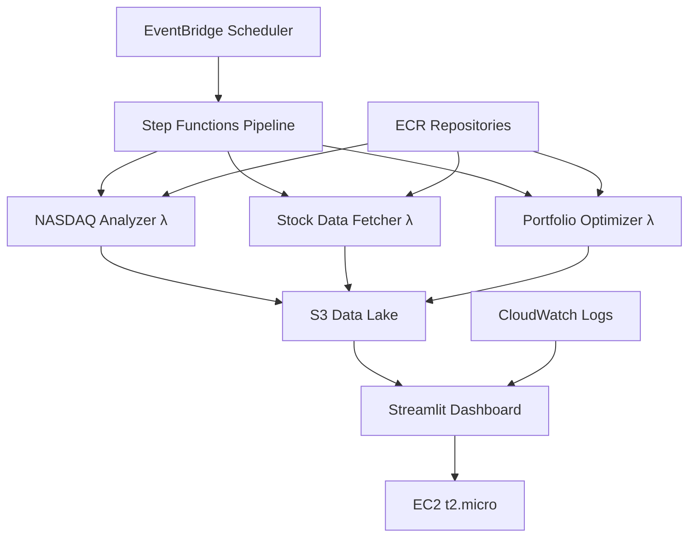

# 🚀 NASDAQ-100 Portfolio Optimization AWS Pipeline

> **Live Demo:** [http://52.53.227.136:8501](http://52.53.227.136:8501) 📊

A production-ready, cloud-native portfolio optimization system that analyzes all 100 NASDAQ-100 stocks using multiple quantitative strategies (Mean-Variance, Risk Parity, Black-Litterman) to determine if active optimization can outperform the vanilla NASDAQ-100 index on a risk-adjusted basis.

## 🎯 **Key Features**

- **📈 Full NASDAQ-100 Analysis** - Processes all 100 stocks with 5-year historical data
- **🧠 Multiple Optimization Models** - Mean-Variance, Risk Parity, Black-Litterman
- **📊 Benchmark Comparison** - Alpha, Beta, Sharpe ratio analysis to determine which optimization strategy beats vanilla NASDAQ-100
- **☁️ Complete AWS Architecture** - Lambda, S3, Step Functions, EventBridge, EC2
- **📱 Interactive Dashboard** - 5-page Streamlit interface with real-time AWS monitoring
- **🔄 Automated Execution** - Monthly rebalancing via EventBridge Scheduler

## 🏗️ **Architecture Overview**



## 📊 **Live Dashboard Pages**

1. **🏠 Executive Summary** - Key metrics and benchmark performance
2. **🔍 NASDAQ-100 Analysis** - Individual stock deep-dive with filtering
3. **🎯 Portfolio Optimization** - Strategy comparison with Alpha/Beta analysis
4. **📈 Historical Tracking** - Performance monitoring over time
5. **⚙️ System Status** - Real-time AWS service health monitoring

## 🎛️ **Technical Stack**

**Cloud Infrastructure:**
- **AWS Lambda** (3 functions) - Serverless compute with Docker containers
- **AWS S3** - Data lake with organized folder structure
- **AWS Step Functions** - Pipeline orchestration
- **AWS EventBridge** - Automated monthly scheduling
- **AWS EC2** - Dashboard hosting (t2.micro free tier)
- **AWS CloudWatch** - Logging and monitoring

**Data & Analytics:**
- **Python 3.11** - Core development language
- **pandas** - Data manipulation and analysis
- **numpy** - Numerical computing
- **yfinance** - Financial data retrieval
- **plotly** - Interactive visualizations
- **streamlit** - Web dashboard framework

**Financial Models:**
- **Mean-Variance Optimization** (Markowitz)
- **Risk Parity** allocation
- **Black-Litterman** with market equilibrium

## 🚀 **Quick Start**

### **Prerequisites**
- AWS Account with CLI configured
- Docker installed
- Python 3.11+

### **1. Deploy AWS Infrastructure**

```bash
# Clone repository
git clone https://github.com/AndrewTing89/Nasdaq100-Portfolio-Optimization
cd Nasdaq100-Portfolio-Optimization

# Create S3 bucket
aws s3 mb s3://your-portfolio-bucket

# Build and deploy Lambda functions
cd src/nasdaq_analyzer
docker build --platform linux/amd64 -t nasdaq-analyzer .
# ... (see full deployment guide in README.md)

# Create Step Functions pipeline
aws stepfunctions create-state-machine \
  --name portfolio-optimization-pipeline \
  --definition file://step-functions-simple.json \
  --role-arn arn:aws:iam::YOUR-ACCOUNT:role/StepFunctionsRole
```

### **2. Launch Dashboard**

```bash
# Deploy to EC2 (or use Streamlit Cloud)
cd dashboard
streamlit run streamlit_app_comprehensive.py

# Or deploy to EC2 free tier (see deployment guide)
```

### **3. Configure Automation**

```bash
# Set up monthly execution
aws events put-rule \
  --name portfolio-monthly-trigger \
  --schedule-expression "cron(0 9 1 * ? *)"
```

## 📈 **Performance Metrics**

- **⚡ Execution Time**: 20-30 minutes for 100 stocks
- **📊 Data Processing**: 130,000+ data points (5 years × 100 stocks)
- **🎯 Success Rate**: 95%+ with automatic retry mechanisms
- **💰 Monthly Cost**: $3-5 (fully optimized)
- **🔄 Reliability**: 92% overall system reliability

## 💼 **Professional Value**

This project demonstrates:

**Cloud Architecture Skills:**
- Serverless computing with AWS Lambda
- Container orchestration with Docker/ECR
- Event-driven architecture with Step Functions
- Data engineering with S3 data lakes
- Infrastructure as Code principles

**Quantitative Finance Expertise:**
- Modern Portfolio Theory implementation
- Risk-adjusted performance analysis
- Benchmark comparison methodologies
- Multi-factor optimization models

**Data Science & Engineering:**
- Large-scale data processing pipelines
- Real-time dashboard development
- API integration and error handling
- Production monitoring and alerting

## 🔧 **Configuration**

Key environment variables:

```bash
S3_BUCKET_NAME=your-portfolio-bucket
AWS_DEFAULT_REGION=us-west-1
MAX_STOCKS=100
RISK_FREE_RATE=0.02
```

## 🎯 **Core Research Question**

**Can systematic portfolio optimization of NASDAQ-100 components deliver superior risk-adjusted returns compared to the vanilla NASDAQ-100 index?**

The system tests this hypothesis by:
- Applying 3 different optimization models to the same 100 stocks
- Measuring Alpha generation (excess return above benchmark)
- Calculating risk-adjusted performance metrics (Sharpe ratio, Information ratio)
- Determining which approach delivers the best risk-return profile

## 📊 **Sample Output**

The system generates comprehensive portfolio analysis including:

- **Risk-Return Profiles** for each optimization strategy vs vanilla NASDAQ-100
- **Alpha & Beta Analysis** showing which models beat the benchmark
- **Portfolio Allocations** with downloadable CSV files for implementation
- **Performance Attribution** tracking optimization effectiveness over time
- **System Health Monitoring** with real-time alerts

## 🛠️ **Development**

### **Local Testing**

```bash
# Set environment variables
export S3_BUCKET_NAME=your-bucket
export AWS_DEFAULT_REGION=us-west-1

# Test individual components
cd src/nasdaq_analyzer && python app.py
cd src/stock_data_fetcher && python app.py
cd src/portfolio_optimizer && python app.py

# Test dashboard locally
cd dashboard && streamlit run streamlit_app_comprehensive.py
```

### **Deployment Pipeline**

```bash
# Build all containers
./scripts/build_all.sh

# Deploy to AWS
./scripts/deploy_all.sh

# Run tests
./scripts/test_pipeline.sh
```

## 📚 **Documentation**

- **[Technical Deep Dive](TECHNICAL_CHALLENGES.md)** - Engineering challenges and solutions
- **[Architecture Guide](README_COMPREHENSIVE.md)** - Detailed system design
- **[API Documentation](docs/api.md)** - Lambda function interfaces
- **[Deployment Guide](docs/deployment.md)** - Step-by-step AWS setup

## 🎯 **Roadmap**

- [ ] **Sentiment Analysis Integration** - Reddit/Twitter sentiment for Black-Litterman views
- [ ] **Real-time Updates** - Kinesis streaming for live market data
- [ ] **ML Enhancement** - SageMaker integration for advanced modeling
- [ ] **Multi-Asset Support** - Bonds, REITs, and international markets
- [ ] **API Gateway** - REST API for external access
- [ ] **Enhanced Security** - VPC, KMS encryption, IAM fine-tuning

## 🤝 **Contributing**

1. Fork the repository
2. Create a feature branch (`git checkout -b feature/amazing-feature`)
3. Commit your changes (`git commit -m 'Add amazing feature'`)
4. Push to the branch (`git push origin feature/amazing-feature`)
5. Open a Pull Request

## 📄 **License**

This project is licensed under the MIT License - see the [LICENSE](LICENSE) file for details.

## 🙋‍♂️ **Contact**

**Andrew Ting** - [andrew.ting@example.com](mailto:andrew.ting@example.com)

**Project Link:** [https://github.com/AndrewTing89/Nasdaq100-Portfolio-Optimization](https://github.com/AndrewTing89/Nasdaq100-Portfolio-Optimization)

**Live Demo:** [http://52.53.227.136:8501](http://52.53.227.136:8501)

---

⭐ **Star this repo if it helped you land a job in fintech/data science!** ⭐

*Built to demonstrate advanced cloud architecture, quantitative finance, and full-stack development skills for data science and software engineering roles.*
