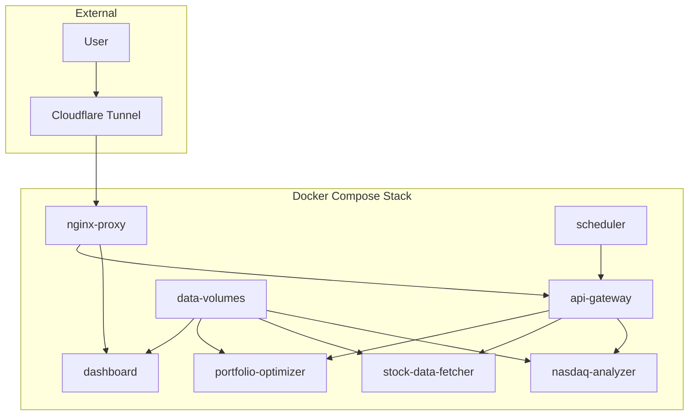

# Complete Docker Architecture Plan
## Portfolio Optimization Self-Hosted Deployment

### Overview

This document provides a complete Docker architecture to replace the current AWS serverless setup (Lambda + S3 + Step Functions + EventBridge) with a self-hosted solution using Docker containers, local storage, and Cloudflare Tunnels for external access.

## Current AWS Architecture Analysis

Based on the codebase analysis, the current architecture consists of:

### AWS Lambda Functions
1. **nasdaq_analyzer** - Scrapes NASDAQ-100 data and calculates undervaluation rates
2. **stock_data_fetcher** - Downloads 5-year historical data for stocks
3. **portfolio_optimizer** - Runs Mean-Variance, Risk Parity, and Black-Litterman optimization

### Data Storage (S3)
- **Bucket**: `portfolio-optimization-jwj`
- **Structure**:
  ```
  raw/                        # Timestamped raw data
  processed/                  # Latest processed results
  data/stocks/               # Individual stock CSV files
  results/phase1/            # NASDAQ analysis summaries
  results/phase2/            # Stock metrics summaries
  results/final/             # Portfolio optimization results
  ```

### Orchestration
- **Step Functions**: Coordinates the 3-phase pipeline
- **EventBridge**: Monthly automated execution (1st of month at 9 AM UTC)

### Dashboard
- **Streamlit app** running on EC2, reading from S3

---

## Docker Architecture Design

### 1. Service Architecture



### 2. Docker Compose Configuration

```yaml
version: '3.8'

services:
  # API Gateway - Coordinates service communication
  api-gateway:
    build: 
      context: ./src/api-gateway
      dockerfile: Dockerfile
    container_name: portfolio-api-gateway
    ports:
      - "8000:8000"
    environment:
      - ENVIRONMENT=production
      - DATA_PATH=/app/data
      - LOG_LEVEL=INFO
      - MAX_STOCKS=${MAX_STOCKS:-100}
      - RISK_FREE_RATE=${RISK_FREE_RATE:-0.02}
    volumes:
      - portfolio-data:/app/data
      - ./logs:/app/logs
    networks:
      - portfolio-network
    restart: unless-stopped
    healthcheck:
      test: ["CMD", "curl", "-f", "http://localhost:8000/health"]
      interval: 30s
      timeout: 10s
      retries: 3

  # NASDAQ Analyzer Service
  nasdaq-analyzer:
    build:
      context: ./src/nasdaq-analyzer
      dockerfile: Dockerfile
    container_name: portfolio-nasdaq-analyzer
    environment:
      - DATA_PATH=/app/data
      - MAX_STOCKS=${MAX_STOCKS:-100}
      - LOG_LEVEL=INFO
    volumes:
      - portfolio-data:/app/data
      - ./logs:/app/logs
    networks:
      - portfolio-network
    restart: unless-stopped
    healthcheck:
      test: ["CMD", "python", "-c", "import requests; requests.get('http://localhost:5000/health')"]
      interval: 30s
      timeout: 10s
      retries: 3

  # Stock Data Fetcher Service  
  stock-data-fetcher:
    build:
      context: ./src/stock-data-fetcher
      dockerfile: Dockerfile
    container_name: portfolio-stock-fetcher
    environment:
      - DATA_PATH=/app/data
      - MAX_STOCKS=${MAX_STOCKS:-100}
      - LOG_LEVEL=INFO
    volumes:
      - portfolio-data:/app/data
      - ./logs:/app/logs
    networks:
      - portfolio-network
    restart: unless-stopped
    healthcheck:
      test: ["CMD", "python", "-c", "import requests; requests.get('http://localhost:5001/health')"]
      interval: 30s
      timeout: 10s
      retries: 3

  # Portfolio Optimizer Service
  portfolio-optimizer:
    build:
      context: ./src/portfolio-optimizer
      dockerfile: Dockerfile
    container_name: portfolio-optimizer
    environment:
      - DATA_PATH=/app/data
      - RISK_FREE_RATE=${RISK_FREE_RATE:-0.02}
      - MIN_WEIGHT_THRESHOLD=${MIN_WEIGHT_THRESHOLD:-0.01}
      - LOG_LEVEL=INFO
    volumes:
      - portfolio-data:/app/data
      - ./logs:/app/logs
    networks:
      - portfolio-network
    restart: unless-stopped
    healthcheck:
      test: ["CMD", "python", "-c", "import requests; requests.get('http://localhost:5002/health')"]
      interval: 30s
      timeout: 10s
      retries: 3

  # Streamlit Dashboard
  dashboard:
    build:
      context: ./src/dashboard
      dockerfile: Dockerfile
    container_name: portfolio-dashboard
    ports:
      - "8501:8501"
    environment:
      - DATA_PATH=/app/data
      - API_GATEWAY_URL=http://api-gateway:8000
      - LOG_LEVEL=INFO
    volumes:
      - portfolio-data:/app/data:ro  # Read-only access for dashboard
      - ./logs:/app/logs
    networks:
      - portfolio-network
    depends_on:
      api-gateway:
        condition: service_healthy
    restart: unless-stopped
    healthcheck:
      test: ["CMD", "curl", "-f", "http://localhost:8501/_stcore/health"]
      interval: 30s
      timeout: 10s
      retries: 3

  # Pipeline Scheduler
  scheduler:
    build:
      context: ./src/scheduler
      dockerfile: Dockerfile
    container_name: portfolio-scheduler
    environment:
      - API_GATEWAY_URL=http://api-gateway:8000
      - SCHEDULE_CRON=${SCHEDULE_CRON:-0 9 1 * *}  # 1st of month at 9 AM
      - LOG_LEVEL=INFO
    volumes:
      - ./logs:/app/logs
    networks:
      - portfolio-network
    depends_on:
      api-gateway:
        condition: service_healthy
    restart: unless-stopped

  # Nginx Reverse Proxy
  nginx-proxy:
    image: nginx:alpine
    container_name: portfolio-nginx
    ports:
      - "80:80"
      - "443:443"
    volumes:
      - ./nginx/nginx.conf:/etc/nginx/nginx.conf:ro
      - ./nginx/ssl:/etc/nginx/ssl:ro
      - ./logs/nginx:/var/log/nginx
    networks:
      - portfolio-network
    depends_on:
      - dashboard
      - api-gateway
    restart: unless-stopped
    healthcheck:
      test: ["CMD", "nginx", "-t"]
      interval: 30s
      timeout: 10s
      retries: 3

volumes:
  portfolio-data:
    driver: local
    driver_opts:
      type: none
      o: bind
      device: ${DATA_DIRECTORY:-./data}

networks:
  portfolio-network:
    driver: bridge
    ipam:
      config:
        - subnet: 172.20.0.0/16
```

### 3. Service Communication Plan

#### REST API Design

**API Gateway (Port 8000)**
- `POST /api/v1/pipeline/run` - Trigger full pipeline
- `POST /api/v1/nasdaq/analyze` - Run NASDAQ analysis only
- `POST /api/v1/stocks/fetch` - Fetch historical data
- `POST /api/v1/portfolio/optimize` - Run optimization
- `GET /api/v1/status` - Get pipeline status
- `GET /api/v1/health` - Health check

**Individual Services**
- **nasdaq-analyzer** (Port 5000): `/analyze`, `/health`
- **stock-data-fetcher** (Port 5001): `/fetch`, `/health`  
- **portfolio-optimizer** (Port 5002): `/optimize`, `/health`
- **dashboard** (Port 8501): Streamlit interface

#### Service Discovery
- Services communicate via container names in Docker network
- API Gateway acts as service mesh coordinator
- Health checks ensure service availability
- Retry logic with exponential backoff

#### Data Flow
1. **Scheduler** → **API Gateway** → Trigger pipeline
2. **API Gateway** → **nasdaq-analyzer** → Analyze NASDAQ-100
3. **API Gateway** → **stock-data-fetcher** → Fetch historical data
4. **API Gateway** → **portfolio-optimizer** → Run optimization
5. **Dashboard** → **Local Data** → Display results

### 4. Local Storage Design

#### Directory Structure
```
./data/                              # Replaces S3 bucket
├── raw/                            # Raw timestamped data
│   ├── nasdaq_100_analysis_YYYYMMDD_HHMMSS.csv
│   └── nasdaq_100_with_returns_YYYYMMDD_HHMMSS.csv
├── processed/                      # Latest processed results
│   ├── nasdaq_100_analysis.csv
│   └── nasdaq_100_with_returns.csv
├── stocks/                         # Individual stock files
│   ├── AAPL.csv
│   ├── MSFT.csv
│   └── ...
├── results/                        # Analysis results
│   ├── phase1/
│   │   └── nasdaq_analysis_summary_YYYYMMDD_HHMMSS.json
│   ├── phase2/ 
│   │   └── stock_metrics_summary_YYYYMMDD_HHMMSS.json
│   └── final/                     # Portfolio optimization results
│       ├── mv_historical_max_sharpe_portfolio_YYYYMMDD_HHMMSS.csv
│       ├── portfolio_performance_comparison_YYYYMMDD_HHMMSS.csv
│       └── recommended_portfolio_YYYYMMDD_HHMMSS.csv
└── config/                         # Configuration files
    ├── nasdaq_symbols.json
    └── optimization_params.json
```

#### Volume Configuration
- **Persistent Volume**: `portfolio-data` mounted to `./data`
- **Backup Strategy**: Daily snapshots to external location
- **Permissions**: Services run as non-root user (UID 1000)
- **Size Management**: Automatic cleanup of files older than 90 days

#### File Access Pattern
```python
# Replace S3Handler operations
class LocalFileHandler:
    def __init__(self, base_path="/app/data"):
        self.base_path = Path(base_path)
    
    def upload_csv(self, df, key):
        file_path = self.base_path / key
        file_path.parent.mkdir(parents=True, exist_ok=True)
        df.to_csv(file_path, index=False)
    
    def download_csv(self, key):
        file_path = self.base_path / key
        if file_path.exists():
            return pd.read_csv(file_path)
        return None
```

### 5. Cloudflare Tunnel Integration

#### Tunnel Configuration
```yaml
# cloudflared/config.yml
tunnel: portfolio-optimization-tunnel
credentials-file: /etc/cloudflared/credentials.json

ingress:
  - hostname: portfolio.yourdomain.com
    service: http://nginx-proxy:80
  - hostname: api.yourdomain.com  
    service: http://api-gateway:8000
  - service: http_status:404
```

#### Security Configuration
- **TLS Termination**: At Cloudflare edge
- **Origin Certificates**: Cloudflare origin certificates for nginx
- **Access Control**: Cloudflare Access for authentication
- **Rate Limiting**: API rate limiting via Cloudflare

#### Domain Setup
- **Dashboard**: `https://portfolio.yourdomain.com`
- **API**: `https://api.yourdomain.com`
- **Health**: `https://api.yourdomain.com/health`

### 6. Dockerfile Specifications

#### API Gateway Dockerfile
```dockerfile
FROM python:3.11-slim

WORKDIR /app

# Install system dependencies
RUN apt-get update && apt-get install -y \
    curl \
    && rm -rf /var/lib/apt/lists/*

# Copy requirements and install Python dependencies
COPY requirements.txt .
RUN pip install --no-cache-dir -r requirements.txt

# Copy application code
COPY . .

# Create non-root user
RUN useradd -m -u 1000 appuser && chown -R appuser:appuser /app
USER appuser

# Create data directory
RUN mkdir -p /app/data /app/logs

EXPOSE 8000

HEALTHCHECK --interval=30s --timeout=10s --start-period=5s --retries=3 \
    CMD curl -f http://localhost:8000/health || exit 1

CMD ["uvicorn", "main:app", "--host", "0.0.0.0", "--port", "8000"]
```

#### Service Dockerfile Template
```dockerfile
FROM python:3.11-slim

WORKDIR /app

# Install system dependencies
RUN apt-get update && apt-get install -y \
    curl \
    && rm -rf /var/lib/apt/lists/*

# Copy requirements and install dependencies  
COPY requirements.txt .
RUN pip install --no-cache-dir -r requirements.txt

# Copy application code
COPY . .

# Create non-root user
RUN useradd -m -u 1000 appuser && chown -R appuser:appuser /app
USER appuser

# Create directories
RUN mkdir -p /app/data /app/logs

EXPOSE 5000

# Service-specific health check
HEALTHCHECK --interval=30s --timeout=10s --start-period=5s --retries=3 \
    CMD python -c "import requests; requests.get('http://localhost:5000/health')" || exit 1

CMD ["python", "app.py"]
```

#### Dashboard Dockerfile  
```dockerfile
FROM python:3.11-slim

WORKDIR /app

# Install system dependencies
RUN apt-get update && apt-get install -y \
    curl \
    && rm -rf /var/lib/apt/lists/*

# Copy requirements and install dependencies
COPY requirements.txt .
RUN pip install --no-cache-dir -r requirements.txt

# Copy dashboard code
COPY . .

# Create non-root user
RUN useradd -m -u 1000 appuser && chown -R appuser:appuser /app
USER appuser

# Create directories
RUN mkdir -p /app/data /app/logs

EXPOSE 8501

# Streamlit health check
HEALTHCHECK --interval=30s --timeout=10s --start-period=5s --retries=3 \
    CMD curl -f http://localhost:8501/_stcore/health || exit 1

CMD ["streamlit", "run", "app.py", "--server.port=8501", "--server.address=0.0.0.0"]
```

### 7. Environment Configuration

#### .env File
```bash
# Data Configuration
DATA_DIRECTORY=./data
MAX_STOCKS=100
RISK_FREE_RATE=0.02
MIN_WEIGHT_THRESHOLD=0.01

# Scheduling
SCHEDULE_CRON=0 9 1 * *

# Logging
LOG_LEVEL=INFO

# Security
SECRET_KEY=your-secret-key-here

# Cloudflare
CF_TUNNEL_TOKEN=your-tunnel-token-here
CF_ZONE_ID=your-zone-id
```

### 8. Health Checks & Monitoring

#### Health Check Endpoints
- **API Gateway**: `GET /health` - Service registry status
- **Services**: `GET /health` - Individual service health
- **Dashboard**: `GET /_stcore/health` - Streamlit health

#### Resource Limits
```yaml
# Resource constraints in docker-compose
services:
  api-gateway:
    deploy:
      resources:
        limits:
          memory: 512M
          cpus: '0.5'
        reservations:
          memory: 256M
          cpus: '0.25'
```

#### Monitoring Stack (Optional)
```yaml
# Additional monitoring services
prometheus:
  image: prom/prometheus
  ports:
    - "9090:9090"
  volumes:
    - ./monitoring/prometheus.yml:/etc/prometheus/prometheus.yml

grafana:
  image: grafana/grafana
  ports:
    - "3000:3000"
  environment:
    - GF_SECURITY_ADMIN_PASSWORD=admin
```

### 9. Restart Policies & Resilience

#### Restart Configuration
- **unless-stopped**: Services restart automatically except manual stops
- **Health Checks**: Containers restart on health check failures
- **Dependencies**: Services wait for dependencies to be healthy

#### Backup Strategy
```bash
#!/bin/bash
# backup.sh - Daily backup script
DATE=$(date +%Y%m%d)
tar -czf /backups/portfolio-data-${DATE}.tar.gz ./data/
find /backups -name "portfolio-data-*.tar.gz" -mtime +30 -delete
```

### 10. Deployment Instructions

#### Prerequisites
```bash
# Install Docker & Docker Compose
curl -fsSL https://get.docker.com -o get-docker.sh
sh get-docker.sh
sudo pip3 install docker-compose

# Create directory structure
mkdir -p portfolio-optimization/{data,logs,nginx,monitoring}
cd portfolio-optimization
```

#### Deployment Steps
```bash
# 1. Clone/copy application files
git clone <your-repo> .

# 2. Set up environment
cp .env.example .env
# Edit .env with your configuration

# 3. Set up SSL certificates
mkdir -p nginx/ssl
# Copy your SSL certificates or use Cloudflare origin certs

# 4. Build and start services
docker-compose build
docker-compose up -d

# 5. Set up Cloudflare tunnel
docker run -d --name cloudflared \
  --network portfolio_portfolio-network \
  -v ./cloudflared:/etc/cloudflared \
  cloudflare/cloudflared:latest tunnel run portfolio-optimization-tunnel

# 6. Verify deployment
docker-compose ps
curl http://localhost/health
```

#### Update Strategy
```bash
# Rolling updates
docker-compose pull
docker-compose up -d --no-deps service-name
```

### 11. Migration from AWS

#### Data Migration
```bash
# Sync S3 data to local
aws s3 sync s3://portfolio-optimization-jwj ./data/

# Update file permissions  
sudo chown -R 1000:1000 ./data/
```

#### Configuration Changes
1. Replace `S3Handler` with `LocalFileHandler`
2. Update environment variables
3. Remove AWS SDK dependencies
4. Update Streamlit dashboard data paths

### 12. Security Considerations

#### Container Security
- **Non-root users**: All services run as UID 1000
- **Read-only filesystems**: Where possible
- **Minimal base images**: Alpine Linux or slim variants
- **Security scanning**: Regular image vulnerability scans

#### Network Security
- **Internal network**: Services communicate on private Docker network
- **Firewall**: Only ports 80/443 exposed externally
- **TLS**: End-to-end encryption via Cloudflare

#### Data Security  
- **Encryption at rest**: Consider encrypting data volume
- **Backup encryption**: Encrypted backups to remote location
- **Access logs**: Comprehensive logging of all access

### 13. Maintenance & Operations

#### Log Management
```bash
# Log rotation configuration
echo '{
  "log-driver": "json-file",
  "log-opts": {
    "max-size": "10m",
    "max-file": "3"
  }
}' | sudo tee /etc/docker/daemon.json
```

#### Update Schedule
- **Monthly**: Security updates for base images
- **Quarterly**: Application updates
- **On-demand**: Critical security patches

#### Troubleshooting
```bash
# Service logs
docker-compose logs -f service-name

# Health status
docker-compose ps
docker inspect --format='{{.State.Health}}' container-name

# Resource usage
docker stats
```

### 14. Cost Analysis

#### Hardware Requirements
- **Minimum**: 4 vCPU, 8GB RAM, 100GB SSD
- **Recommended**: 8 vCPU, 16GB RAM, 200GB SSD
- **Network**: 1Gbps connection recommended

#### Operational Costs
- **Server**: $50-150/month (depending on provider)
- **Cloudflare**: Free tier sufficient 
- **Domain**: $10-15/year
- **Backups**: $10-20/month (object storage)

**Total**: ~$60-180/month vs AWS ~$200-400/month

### 15. Performance Optimizations

#### Caching Strategy
- **Redis**: Optional caching layer for frequently accessed data
- **CDN**: Cloudflare CDN for static assets
- **Application**: In-memory caching for repeated calculations

#### Scaling Options
- **Horizontal**: Multiple instances behind load balancer
- **Vertical**: Increase container resource limits
- **Database**: Optional PostgreSQL for metadata storage

---

## Implementation Timeline

### Phase 1: Core Services (Week 1)
- [ ] Create Dockerfiles for all services
- [ ] Implement LocalFileHandler
- [ ] Set up API Gateway
- [ ] Create docker-compose configuration

### Phase 2: Service Integration (Week 2)
- [ ] Implement REST APIs for services
- [ ] Set up inter-service communication
- [ ] Create scheduler service
- [ ] Update dashboard for local data access

### Phase 3: External Access (Week 3) 
- [ ] Configure nginx reverse proxy
- [ ] Set up Cloudflare Tunnel
- [ ] Implement SSL/TLS
- [ ] Test end-to-end functionality

### Phase 4: Production Ready (Week 4)
- [ ] Add monitoring and logging
- [ ] Implement backup strategy  
- [ ] Security hardening
- [ ] Performance optimization
- [ ] Documentation and runbooks

## Conclusion

This Docker architecture provides a complete replacement for the AWS serverless infrastructure with:

- **Cost Savings**: 50-70% reduction in monthly costs
- **Full Control**: Complete ownership of the infrastructure
- **Scalability**: Horizontal scaling capabilities
- **Reliability**: Built-in health checks and restart policies  
- **Security**: Multiple layers of security controls
- **Maintainability**: Standard Docker deployment patterns

The architecture maintains all functionality of the original AWS setup while providing greater flexibility and cost efficiency for self-hosted deployment.